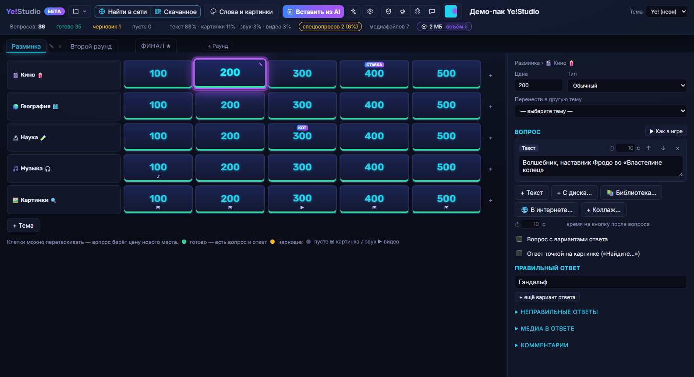
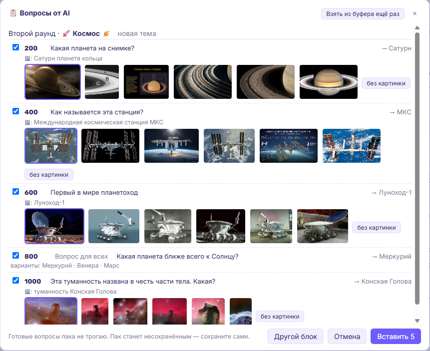
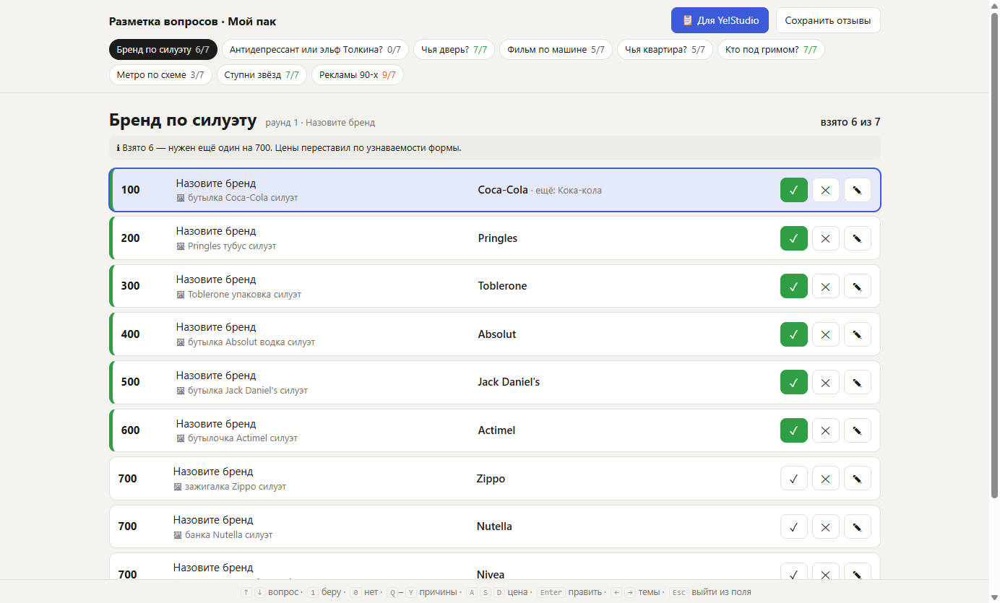
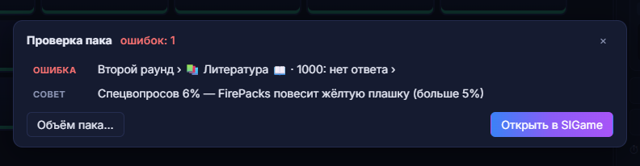
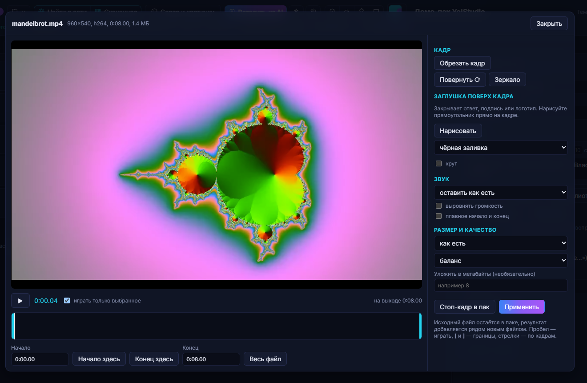
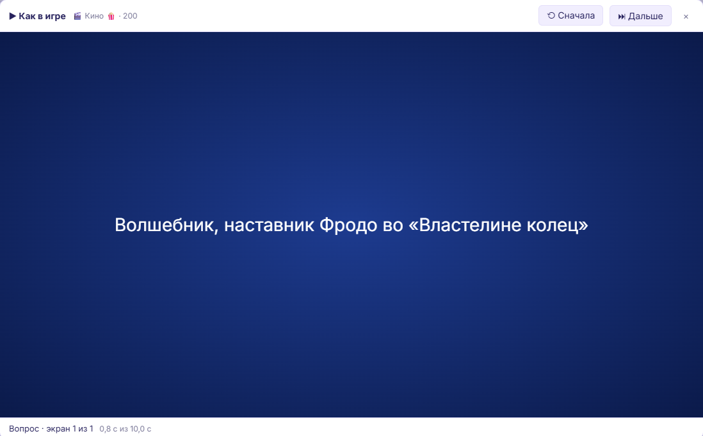
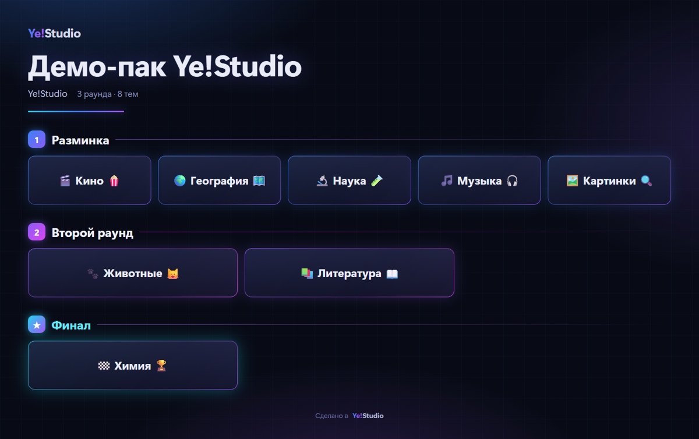

# Ye!Studio

**Мастерская паков для «Своей игры»** ([SIGame](https://github.com/VladimirKhil/SI), формат `.siq`).
Табло и редактор вопросов, медиа-редакторы, поиск картинок и видео прямо в приложении, вставка вопросов из
Claude и ChatGPT, проверка пака перед публикацией. Windows 10/11.



## Скачать

**[⬇ Скачать (релизы)](../../releases)** → файл `Ye-Studio-Setup-….exe` → запустить → «Далее».
Терминал, Node.js и прочее не нужны. ffmpeg и yt-dlp приложение предложит поставить само при первом запуске.

> Установщик не подписан сертификатом, поэтому Windows может показать «Система Windows защитила ваш компьютер».
> Нажмите **«Подробнее» → «Выполнить в любом случае»**. Исходный код установщика — в этом репозитории.

## Что умеет

### Вопросы из Claude / ChatGPT — с галочками и картинками на лету
Попросите ИИ придумать тему — он выдаст блок, который вставляется в пак одной кнопкой **«Вставить из AI»**.
Каждый вопрос можно отключить галочкой, а картинки к вопросам приложение ищет само, пока вы смотрите список:
щелчок по нужной — и она поедет в вопрос.



### Разметка вопросов в браузере
Кнопка **🤝 Помощник** настраивает Claude или ChatGPT: ИИ присылает пачку вопросов страницей разметки.
Берёте/отклоняете клавишами `1` / `0`, правите цену и текст, жмёте **«Для Мастерской»** — и вставляете в пак.



### Проверка пака перед публикацией
Пустые вопросы и вопросы без ответа, ссылки на файлы, которых нет в паке, повторяющиеся ответы, объём
(100 МБ для SIBrowser/FirePacks), доля спецвопросов по порогам FirePacks. Щелчок по строке — к вопросу.
Оттуда же — **«Открыть в SIGame»**.



### Медиа-редактор
Обрезка видео и звука по времени, кадрирование, заглушки поверх кадра (закрыть ответ или логотип),
выравнивание громкости, плавное начало и конец, стоп-кадр в пак, сжатие под нужный размер.



### «Как в игре»
Вопрос проигрывается так, как его покажет SIGame: экраны, время показа, «Жмите кнопку!».



### Афиша для соцсетей
Одна картинка со всеми темами пака по раундам и готовый текст поста.



### И ещё
- **Поиск медиа** — картинки, звук и видео (YouTube, Rutube и ещё ~1800 сайтов через yt-dlp) с загрузкой прямо в вопрос;
  всё скачанное лежит в «Скачанном».
- **Слова и картинки** — темы на словах (анаграммы, матрицы) и ИИ-картинки: локально (stable-diffusion.cpp) или облако.
- **Картинки** — коллажи, «картина по пикселям», силуэты, номер пака на логотипе.
- **Страховка** — Ctrl+Z / Ctrl+Y, резервные копии при каждом сохранении, восстановление после сбоя.
- **Компоненты** — ffmpeg, yt-dlp и локальная модель картинок ставятся и обновляются из приложения;
  yt-dlp раз в неделю обновляется сам.
- Темы оформления: неон, студия, бумага, пастель, минимал, ночь.

## Сборка из исходников

```bash
cd app
npm ci
npm run fetch-dict   # словари для тем на словах (в git не входят)
npm run dev          # окно в режиме разработки
npm run typecheck && npm test
npm run dist:update  # установщик в app/dist-setup
```

Скриншоты для README снимаются на демо-паке: `npx tsx scripts/demo-pack.ts demo.siq` (медиа рисует ffmpeg).

## Что приложение отправляет

На сервер автора (`server/`) уходят только: анонимный ID установки и версия (статистика запусков), отчёты об ошибках
(без путей и имени пользователя; выключаются в «⚙ ИИ → Прочее») и отзывы, которые вы отправили сами.
Выключения приложения по команде нет. Обновления приходят с того же сервера и ставятся только с вашего согласия.

## Спасибо

- [SIGame и SIQuester](https://github.com/VladimirKhil/SI) — Владимир Хиль: игра, формат `.siq` и его спецификация.
- [SI-HYX](https://github.com/GoldensFire/SI-HYX) (GoldensFire) и [SiGame-Helper](https://github.com/Inomirec/SiGame-Helper) —
  подготовка медиа для паков; многие решения Ye!Studio повторяют их.
- [FirePacks](https://firepacks.net/) — пороги доли спецвопросов.
- [LosslessCut](https://github.com/mifi/lossless-cut) — идеи для обрезки видео.
- [yt-dlp](https://github.com/yt-dlp/yt-dlp), [ffmpeg](https://ffmpeg.org/), [stable-diffusion.cpp](https://github.com/leejet/stable-diffusion.cpp).

## Лицензия

[GPL-3.0-or-later](LICENSE). Можно использовать, изменять и распространять; изменённые версии тоже должны
распространяться с исходным кодом под GPL.
